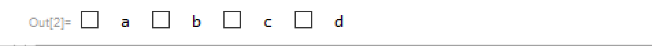
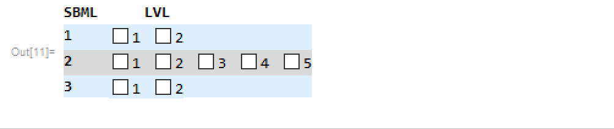

# CheckBox
Examples of checkbox bar:
 - disabling other boxes when one is checked , able to unckeck and use another box
 - checking more than one will uncheck last one check so there will be only one checked

### CheckBox Disabled When Checked

 Unchecked boxes will be disabled when max number of them is checked
 

###  CheckBox Will Uncheck last box

  When checking another box, last checked box becomes unchecked

